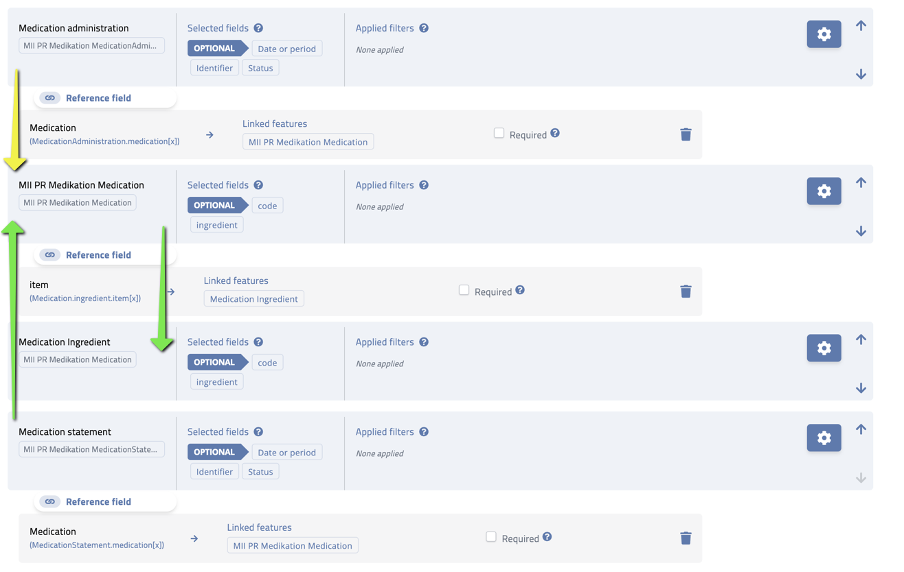

# dup-pipeline-analysis-example

Example analysis of a DUP pipeline export. The export in
`20260925_1235_88129f43-b72a-4565-af8a-7cc48a3363be/` contains the FHIR resources (`dimp/*.ndjson`),
the SQL-on-FHIR ViewDefinitions (`viewdefinitions/`) and the flattened tables they produce (`csv/`).

`example_joins.py` loads all CSV tables into an in-memory SQLite database and runs example joins.

```sh
python3 example_joins.py [csv_dir]
```

It needs only the Python standard library. All columns are loaded as text, and empty cells become `NULL`.

## The CRTDL selects the fields

Two inputs decide what lands in the CSVs:

- The **CRTDL** ([example-crtdl-analysis.json](example-crtdl-analysis.json)) decides *which* resources
  and fields are extracted. Each entry in `dataExtraction.attributeGroups` becomes one CSV table,
  named after the group's `name`. Its `attributes` list the selected FHIR elements (`attributeRef`).
- A **flattening lookup**, maintained outside this repository, decides *how* each selected element is
  flattened into columns and rows. The result is the ViewDefinitions in `viewdefinitions/`.

### Example: the same Condition resources, two tables

The CRTDL contains two attribute groups for the same profile (`.../modul-diagnose/StructureDefinition/Diagnose`):

| Attribute group | Selected attributes | CSV columns |
| --- | --- | --- |
| `diagnosis-code-and-rec-date-only` | `Condition.recordedDate`, `Condition.code.coding:sct`, `Condition.encounter` | 7 |
| `Diagnosis-all-fields` | 15 attributes, including `Condition.code`, `Condition.onset[x]`, `Condition.clinicalStatus`, `Condition.stage` | 90 |

Both tables contain the same 10 Conditions. Each table only has columns for the attributes its group
selects:

- `diagnosis-code-and-rec-date-only.csv` has `id`, `patient`, `Condition_recordedDate`, the three
  `Condition_code_codingSct_*` columns and `Condition_encounter_reference`.
- `Diagnosis-all-fields.csv` has no encounter column, because that group does not select
  `Condition.encounter`.

The flattening lookup determines the column layout for each selected attribute:

- `Condition.code.coding:sct` selects only the SNOMED CT slice and gives the three `Condition_code_codingSct_*` columns.
- `Condition.code` selects the whole element. The lookup flattens it into one column set per coding slice:
  `Condition_code_codingAlphaid_*`, `..._codingIcd10gm_*` (with its extensions), `..._codingOrphanet_*` and `..._codingSct_*`.
- `Condition.text` is selected in `Diagnosis-all-fields` but has no column, so the lookup does not flatten it.

### Linked groups

An attribute that holds a reference can point to another attribute group with `linkedGroups`. This is
how the tables become joinable. Example: `MedicationAdministration.medication[x]` and
`MedicationStatement.medication[x]` link to the `MII PR Medikation Medication` group, and
`Medication.ingredient.item[x]` links to the
`Medication Ingredient` group. `Medication Ingredient` has `includeReferenceOnly: true`. It therefore
contains only Medications that another extracted resource references, here the glucose solution `b465502f...`.

## From FHIR resources to rows

A FHIR resource is a tree. A CSV table is flat. The ViewDefinition decides how the tree becomes rows
and columns. It does this in two ways:

- **Sideways into columns.** Elements that occur at most once, or that a `where(...)` filter reduces to
  one element, become columns. Example: `Medication.code.coding` holds a PZN, an ATC (BfArM) and an ATC
  (WHO) coding. The ViewDefinition selects each with `coding.where(system = '...')`, so each ends up in
  its own columns (`Medication_code_codingPharmazentralnummer_code`, `Medication_code_codingAtcclassde_code`, ...).
- **Downwards into rows.** A repeating element under `forEachOrNull` produces one row per element.
  All other columns of the resource are repeated in each of these rows.
  `forEachOrNull` also keeps one row with `NULL`s when the element is absent.

### Example: Medication with two ingredients

Medication `85f96e98...` is a Doxorubicin infusion in glucose solution. It has two `ingredient`
elements. The first holds the active ingredient inline. The second references another Medication, the
glucose solution `b465502f...` (shortened, `meta` removed):

```json
{
  "resourceType": "Medication",
  "id": "85f96e988efc6d21552be359612c8d01",
  "code": { "text": "Infusion bestehend aus 85mg Doxorubicin ... in 250ml 5-%iger ... Glucose-Infusionsloesung" },
  "ingredient": [
    {
      "isActive": true,
      "itemCodeableConcept": { "coding": [ { "extension": [ { "url": ".../data-absent-reason", "valueCode": "masked" } ] } ] },
      "strength": {
        "numerator":   { "value": 85,  "unit": "mg" },
        "denominator": { "value": 250, "unit": "milliliter" }
      }
    },
    {
      "isActive": true,
      "itemReference": { "reference": "Medication/b465502f20feefb51452b4e358f1be2c" }
    }
  ]
}
```

The Medication ViewDefinition contains `"forEachOrNull": "ingredient"`. The one resource therefore
becomes two rows in `MII PR Medikation Medication.csv`, one per ingredient, with the same `id`:

| id | ingredient_isActive | ingredient_item_X_Itemreference_reference | strength_numerator | strength_denominator |
| --- | --- | --- | --- | --- |
| 85f96e98... | true | | 85 mg | 250 milliliter |
| 85f96e98... | true | Medication/b465502f... | | |

The referenced glucose solution `b465502f...` has two ingredients itself, glucose (`isActive: true`)
and water for injection (`isActive: false`). It becomes two rows as well:

| id | ATC | ingredient ASK | ingredient_isActive | strength |
| --- | --- | --- | --- | --- |
| b465502f... | V06DC01 | 12829 (glucose) | true | 50 g / 1000 ml |
| b465502f... | V06DC01 | 00343 (water) | false | |

Consequences for analysis:

1. **`id` is not unique in a table.** One row is one ingredient (or one coding, one identifier, ...), not
   one resource. Count resources with `COUNT(DISTINCT id)`, not `COUNT(*)`.
2. **Joins multiply rows.** A row that joins to a resource with *n* rows becomes *n* rows.
3. **Several `forEachOrNull` at the same level form a cross product.** Two repeating elements with 2 and
   3 entries give 6 rows for one resource. Example: each Encounter has two `type` codings
   (`einrichtungskontakt`, `normalstationaer`), so the 10 Encounters give 20 rows.

## Joins

A join combines rows from two tables where a join condition is true. In this export, resources refer
to each other with FHIR references of the form `<ResourceType>/<id>`, while the `id` column holds the
bare id. The join condition therefore adds the prefix:

```sql
ON ma.MedicationAdministration_medication_X_Medicationreference_reference = 'Medication/' || m.id
```

The patient reference works the same way: `ma.patient = 'Patient/' || p.id`.

Two join types are used:

- **`JOIN` (inner join)** keeps only rows that have a match on both sides.
- **`LEFT JOIN`** keeps all rows of the left table. Where no match exists, the columns of the right
  table are `NULL`.

### 1. Medication administration -> Medication -> Medication Ingredient

Chain of two `LEFT JOIN`s:

1. `med_admin` to `medication` via the medication reference of the administration.
2. `medication` to `med_ingredient` via `Medication_ingredient_item_X_Itemreference_reference`, the
   reference to another Medication used as an ingredient.

A Medication holds its ingredient either inline (like the Doxorubicin row above) or as a reference to
another Medication (like the glucose row). The query shows one ingredient per row. It takes the
ingredient from `med_ingredient` if a reference exists (`ingredient_source = referenced`), otherwise
from the medication's own ingredient columns (`ingredient_source = inline`). Because both joins are
`LEFT JOIN`s, administrations and medications without a referenced ingredient stay in the result.

Result: 22 rows from 20 administrations. Medications with two ingredients have two rows, so their
administrations appear twice. Example: `ab688c10...` (J01CR02, amoxicillin and clavulanic acid). In this
export no administration uses the compound Medication `85f96e98...`, so every row is `inline`. Join 1b
shows the `referenced` case.

### 1b. Medication statement -> Medication -> Medication Ingredient

Example screenshot crtdl, green arrows = Medication statement -> Medication -> Medication Ingredient



Same pattern as join 1, starting from `med_statement`. Statements have either
`effective[x]` as a date-time or as a period, so `effective_start` takes the date-time if present,
otherwise the period start. `ingredient_active` shows `ingredient.isActive`.

Statement `caeb31ac...` references the compound Medication `85f96e98...`. It shows all three levels
in one result: statement, medication and the ingredients of the referenced Medication.

| ingredient_source | ingredient_medication_id | ingredient_ask | ingredient_active | ingredient_strength |
| --- | --- | --- | --- | --- |
| inline | | (masked, Doxorubicin) | true | 85 mg |
| referenced | b465502f... | 12829 (glucose) | true | 50 g |
| referenced | b465502f... | 00343 (water) | false | |

The single statement becomes three rows:

1. `85f96e98...` has two ingredient rows (see [Example: Medication with two ingredients](#example-medication-with-two-ingredients)).
2. The inline row has no reference and stays one row.
3. The referencing row matches both ingredient rows of `b465502f...` and becomes two rows.

The ingredients sit on two levels. Level 1 holds the ingredients of the compound Medication
(Doxorubicin, glucose solution). Level 2 holds the ingredients of the glucose solution (glucose, water).
The query replaces the reference with level 2. The glucose solution itself therefore appears only as
`ingredient_medication_id`, not as its own ingredient row. An analysis at ingredient level must decide
which level it needs. The `ingredient_active` column separates active ingredients from excipients such
as the water.

Result: 27 rows from 23 statements.

### 2. Medication -> Medication Ingredient

Inner `JOIN` from `medication` to `med_ingredient` on the ingredient reference. Only medications that
reference another Medication as an ingredient remain. Here that is `85f96e98...`, joined to the two
rows of the glucose solution `b465502f...`.

Result: 2 rows. The one referencing row of `85f96e98...` matches both rows of `b465502f...`.

### 3. Patient -> Medication administration -> Medication (summary)

Inner `JOIN` from `patient` to `med_admin` (only patients with at least one administration), then
`LEFT JOIN` to `medication`. `GROUP BY p.id` reduces the result to one row per patient.

- `COUNT(DISTINCT ma.id)` counts administrations. `COUNT(*)` would also count the extra rows from
  medications with several ingredients.
- `GROUP_CONCAT(DISTINCT ...)` lists the ATC codes per patient.

Result: 9 rows, one per patient with administrations.

### 4. Laboratory test -> Encounter

Inner `JOIN` from `lab` to `encounter` via `Observation_encounter_reference`. It adds the encounter
period to each lab value.

Each Encounter has two rows (two `type` codings, see above), so the join first gives two identical rows
per lab value. `SELECT DISTINCT` removes these duplicates, because none of the selected encounter columns
differ between the two rows.

Result: 31 rows, one per lab test.
